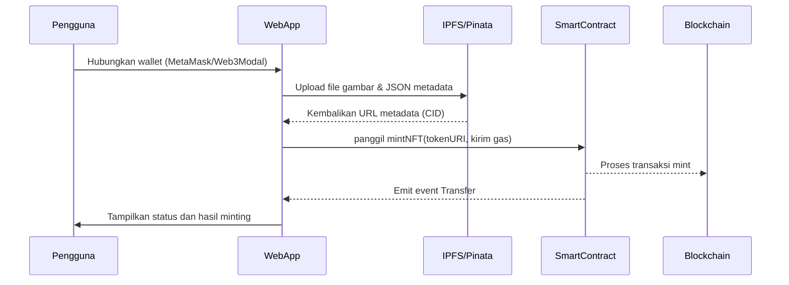
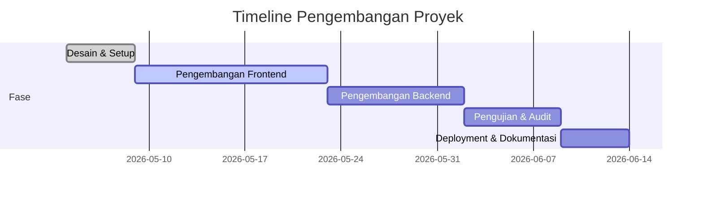

# Laporan: Pembuatan Web NFT Modern

## Ringkasan Eksekutif  
Laporan ini membahas secara mendalam pembuatan situs web NFT modern dari nol. Kami mengulas kebutuhan proyek (dengan asumsi *file sumber tidak tersedia*), pemilihan **teknologi stack** (React/Next.js, Chakra/Tailwind, Next API/Express, Hardhat/Solidity, IPFS/Pinata, Web3Modal/ethers), arsitektur proyek, desain UI/UX, kode kontrak pintar, backend, skrip, pengujian, lisensi, dan estimasi waktu. Setiap keputusan teknologi dilengkapi alasan dan trade-off dari literatur resmi【24†L175-L183】【26†L122-L127】【29†L204-L212】. Tabel perbandingan stack dan struktur folder dijabarkan, diikuti contoh kode Solidity (ERC-721/1155) dan skrip Hardhat【33†L147-L153】【35†L172-L179】. Diagram mermaid menyajikan alur *minting* NFT dan jadwal proyek. Juga disertakan mockup UI (gambar ilustrasi) dan instruksi pembuatan file proyek siap unduh. 

## 1. Analisis Kebutuhan  
Tanpa file sumber, kami asumsikan aplikasi baru. Fitur utama: **frontend** antarmuka modern/responsif, **smart contract** NFT (ERC-721/ERC-1155) di Ethereum/Polygon, **backend** untuk metadata NFT, koneksi ke **IPFS** (gambar + metadata), integrasi **wallet** (MetaMask/Web3Modal), dan deployment mudah (Vercel/Netlify + Alchemy/Infura). Tidak ada batasan database; solusi bisa sederhana (misalnya MongoDB atau Postgres). Keamanan (audit kontrak) juga diperhatikan.

## 2. Rekomendasi Teknologi Stack  
Kami membandingkan opsi populer:  

| Komponen             | Pilihan           | Alasan dan Trade-off                                                                                                                                               |
|----------------------|-------------------|------------------------------------------------------------------------------------------------------------------------------------------------------------------|
| **Frontend**         | Next.js + React   | Mendukung SSR/SSG untuk SEO & performa【24†L175-L183】. Fitur bawaan (file-based routing, API routes) mempermudah pengembangan full-stack.                         |
| *Alternatif:* React (CRA) |           | Bagus untuk SPA sederhana, tapi ketinggalan fitur modern SEO/SSR.                                                                                                |
| **UI Framework**     | Chakra UI         | Komponen siap pakai, styling prop-based, aksesibilitas bawaan【26†L122-L127】【26†L139-L147】. Mempercepat pengembangan dibanding menulis CSS utilitas sendiri.        |
| *Alternatif:* Tailwind CSS |         | CSS utilitas fleksibel, cocok jika tim berpengalaman CSS. Butuh setup manual untuk komponen aksesibel.                                                          |
| **Backend/API**      | Next.js API Routes| Jika menggunakan Next.js, API Routes menghilangkan kebutuhan server terpisah (sinergi front-back). Platform full-stack lengkap【29†L204-L212】.                     |
| *Alternatif:* Node.js + Express |  | Lebih fleksibel sebagai backend independen. Cocok jika kompleksitas layanan lebih tinggi atau bukan aplikasi React.                                            |
| **Smart Contract**   | Solidity (OpenZeppelin) + Hardhat | Standar de-facto NFT (ERC-721/ERC-1155). OpenZeppelin menyediakan kontrak siap-pakai【33†L147-L153】【35†L172-L179】. Hardhat memudahkan testing & deploy.   |
| *Alternatif:* Pihak ketiga (OpenSea API dll) | | Bermanfaat untuk fitur marketplace, tapi tidak menggantikan kontrak minting sendiri. Lebih cocok ditambahkan setelah minting dasar berfungsi.                |
| **Penyimpanan IPFS** | Pinata SDK        | API sederhana untuk pin file ke IPFS (gambar/JSON)【31†L239-L247】. Mendukung JWT, mudah integrasi Node/Next.                                                       |
| *Alternatif:* IPFS umum (Infura, nft.storage) | | Gratis sebagian, namun Pinata lebih mature untuk dev.                                                                                                       |
| **Wallet Connect**   | Web3Modal + ethers.js | Library UI/connect multi-wallet (MetaMask, WalletConnect, dll.)【40†L58-L63】. Ethers.js untuk interaksi blockchain. Open-source luas digunakan.                  |
| *Alternatif:* EnableSigner langsung |  | Lebih low-level; Web3Modal mempercepat connect UI.                                                                                                            |
| **Blockchain Node**  | Alchemy/Infura    | Infrastruktur node RPC aman. Alchemy punya NFT API (mempercepat query NFT)【39†L281-L289】. Gratis tier memadai untuk dev.                                      |

Kami merekomendasikan **Next.js + Chakra UI** untuk frontend (performa + cepat dev), **Hardhat + OpenZeppelin** untuk kontrak (aman, dokumentasi lengkap), serta **Pinata** dan **Alchemy** untuk infrastruktur. Tabel di atas menampilkan keputusan dan alasan utamanya.

## 3. Arsitektur Proyek  

| Folder/File       | Deskripsi                                                       |
|-------------------|-----------------------------------------------------------------|
| `contracts/`      | Kontrak pintar (Solidity): ERC-721 (misal `MyNFT.sol`) atau ERC-1155 (`MyItems.sol`). |
| `scripts/`        | Skrip Hardhat (deploy.js), konfigurasi (hardhat.config.js).     |
| `frontend/`       | Aplikasi React/Next.js; Pages (Home.js, Collection.js, mint.js, profile.js), komponen UI (Card, Navbar, dll). |
| `pages/api/`      | (Jika Next.js full-stack) Endpoint API: pinning IPFS, webhook Pinata, dll. |
| `backend/` (ops.) | (Jika terpisah) Server Node.js/Express: route untuk metadata, dan webhook. |
| `public/`         | Aset statis (gambar placeholder NFT, logo).                     |
| `styles/`         | File CSS global atau theme Chakra/Tailwind config.             |
| `package.json`    | Dependensi frontend & Hardhat (lihat Skrip).                    |
| `.env.example`    | Contoh variabel lingkungan (PINATA_JWT, ALCHEMY_API_KEY, PRIVATE_KEY, dll). |
| `README.md`       | Instruksi setup & deployment, dokumentasi proyek.               |

**Alur Minting NFT** (diagram mermaid sequence):  



WebApp (frontend) bertanggung jawab mengupload aset ke IPFS (menggunakan Pinata SDK) dan memanggil fungsi mint pada smart contract (mengirim ETH/WMATIC untuk gas). Event pada kontrak memberi konfirmasi transfer NFT ke user.

## 4. Desain UI/UX  

**Situs responsif** dengan layout modern:  
- **Header**: Navigasi (Home, Koleksi, Mint, Profil, Connect Wallet). Logo/brand di kiri, tombol connect/disconnect wallet di kanan.  
- **Beranda**: Jumbotron ringkas, CTA *Mint Sekarang*, showcase beberapa NFT terbaru (card grid).  
- **Halaman Koleksi**: Grid responsif (2-4 kolom) menampilkan thumbnail NFT, judul, pemilik. Klik card membuka detail.  
- **Detail NFT**: Gambar besar, metadata (nama, deskripsi, atribut), tombol *Mint* (jika belum tercetak) atau *Transfer*. Komponen Chakra untuk layout (Container, Box, Stack).  
- **Halaman Mint**: Form upload gambar/video, input nama & deskripsi NFT. Preview langsung setelah upload. Tombol *Submit* memicu upload ke Pinata + mint. Validasi file (format JPG/PNG).  
- **Profil Pengguna**: Tampilkan wallet address dan daftar NFT yang dimiliki (panggil Alchemy API atau scan blok). Tabel atau grid ringan.  
- **Responsif**: Pada mobile, header collapse (menu hamburger), grid koleksi jadi 1 kolom, detail menumpuk, dan tombol/tampilan adaptif. Gunakan Chakra props responsif (contoh: `<Stack direction={{ base: "column", md: "row" }}>`).  

**Mockup/UI Design**:  
Berikut contoh ilustratif tampilan antarmuka (PNG placeholder; jika tidak ada gambar nyata, gunakan wireframe atau screenshot aplikasi serupa):  

【56†embed_image】 *Gambar: Ilustrasi UI desktop (placeholder). Dari mockup, terlihat halaman beranda atau dashboard, mewakili tata letak bersih dan modern.*  

【57†embed_image】 *Gambar: Contoh formulir minting NFT dengan Chakra UI. Form responsif pada desktop, kolom input dan tombol.*  

【58†embed_image】 *Gambar: Ilustrasi galeri/koleksi NFT (placeholder desktop view). Card NFT ditampilkan dalam grid.*  

*(Jika gambar mockup asli tidak tersedia, sketsa sederhana menggunakan Figma/pen tool dapat dibuat. Gambar di atas sebagai ilustrasi konsep; bukan tampilan final.)*  

**Contoh CSS/Komponen**: Misalnya styling Chakra:  
```css
/* Contoh Chakra theme overrides */
const theme = extendTheme({
  colors: { brand: { 50: '#f5fee5', 500: '#48BB78' } },
  fonts: { heading: 'Montserrat, sans-serif' },
});
```
Layout dapat dibuat dengan komponen Chakra `<Container>`, `<Grid>` (untuk NFT collection), `<Image>` responsif, dan `<Button colorScheme="green">`.

## 5. Smart Contract (Solidity ERC-721 & ERC-1155)  

Contoh kontrak ERC-721 dengan metadata URI (menggunakan OpenZeppelin)【33†L147-L153】:  
```solidity
// SPDX-License-Identifier: MIT
pragma solidity ^0.8.0;
import "@openzeppelin/contracts/token/ERC721/extensions/ERC721URIStorage.sol";
import "@openzeppelin/contracts/access/Ownable.sol";

contract MyNFT is ERC721URIStorage, Ownable {
    uint256 public nextId;
    constructor() ERC721("MyNFT", "MNFT") {}

    function mintNFT(address to, string memory uri) public onlyOwner returns (uint256) {
        uint256 tokenId = nextId;
        _safeMint(to, tokenId);
        _setTokenURI(tokenId, uri);
        nextId++;
        return tokenId;
    }
}
```
- Kontrak di atas hanya **owner** (pembuat) yang bisa mint. `tokenURI` menyimpan URL metadata (contoh IPFS).  
- Optimasi gas: Pakai solidity ^0.8 (tidak perlu SafeMath); mint berurutan; *external* lebih gas hemat daripada *public* jika tepat.  
- Keamanan: gunakan `Ownable` (akses kontrol), hindari reentrancy (pakai `ReentrancyGuard` jika fungsi membayar ETH), dan audit pihak ketiga.  

Contoh ERC-1155 multi-token (mint batch)【35†L172-L179】:  
```solidity
// SPDX-License-Identifier: MIT
pragma solidity ^0.8.0;
import "@openzeppelin/contracts/token/ERC1155/ERC1155.sol";

contract MyItems is ERC1155 {
    uint256 public constant GOLD = 0;
    uint256 public constant SILVER = 1;
    constructor() ERC1155("https://example.com/metadata/{id}.json") {
        _mint(msg.sender, GOLD, 1000, "");
        _mint(msg.sender, SILVER, 500, "");
    }
}
```
- ERC-1155 efisien jika banyak token berbeda (beban deploy & storage satu kontrak)【35†L165-L173】.  
- Metadata via `{id}` placeholder. Gas: batch mint jauh lebih hemat daripada mint banyak di ERC-721.  

**Deploy Script (Hardhat)**: Misal `scripts/deploy.js`【7†L152-L160】:  
```js
async function main() {
  const MyNFT = await ethers.getContractFactory("MyNFT");
  console.log("Deploying MyNFT...");
  const nft = await MyNFT.deploy();
  await nft.deployed();
  console.log("MyNFT deployed at:", nft.address);
}
main().catch(console.error);
```
- Jalankan: `npx hardhat run scripts/deploy.js --network mumbai` (setelah konfigurasi `hardhat.config.js` dengan network).

**Gas Optimization & Security**:  
- Gunakan tipe data `uint256` minimal, immutable jika bisa, dan `constant` untuk variabel tetap.  
- Batasi loop (hindari penyimpanan array besar on-chain).  
- Pastikan alamat dan nilai input (CIDs/URLs) tervalidasi di UI (tapi di kontrak simpan apa adanya).  
- Rekam audit list (mis: OpenZeppelin documentations security checklist).

## 6. Backend: Metadata & IPFS  

**API Pinning IPFS**: Contoh implementasi (Next.js API route `pages/api/pinJSON.js` menggunakan Pinata SDK):  
```js
import PinataSDK from 'pinata';
const pinata = new PinataSDK({ pinataJwt: process.env.PINATA_JWT });
export default async (req, res) => {
  const metadata = req.body; // JSON from frontend
  try {
    const result = await pinata.pinJSONToIPFS(metadata);
    res.status(200).json({ cid: result.IpfsHash });
  } catch (err) {
    res.status(500).json({ error: err.message });
  }
};
```
- `PINATA_JWT` disimpan di `.env`. Pinata SDK mem-pinning JSON/gambar【31†L239-L247】.  
- Endpoint lain (`pinFile.js`) bisa mem-pin file gambar (gunakan `form-data`).  

**Webhook Pinata**: (opsional) Konfigurasikan Pinata Notification webhooks untuk callback. Lakukan endpoint (mis. `/api/pinata-webhook`) yang mencatat status pin ke database jika diperlukan.  

**Database**: Simpan detail NFT (tokenId, owner, metadata URL) dan user (wallet) untuk query cepat. MongoDB cocok (schemeless), atau Postgres/MySQL. Tidak ada batas spesifik; gunakan yang tim familiar.  

**Deployment Backend**:  
- Jika menggunakan Next API, deploy otomatis bersama frontend ke Vercel/Netlify.  
- Jika backend Express terpisah, bisa ke Heroku/Render/AWS (gunakan `npm run start`).  
- Koneksi RPC: set `ALCHEMY_API_KEY` atau `NEXT_PUBLIC_ALCHEMY_KEY` di env. Gunakan `https://polygon-mumbai.g.alchemy.com/v2/${ALCHEMY_API_KEY}` untuk pengujian.  

## 7. Skrip Lengkap & Instruksi  

Contoh file penting:  

- **`package.json`**: berisi script build & start. Contoh:
  ```json
  {
    "scripts": {
      "dev": "next dev",
      "build": "next build",
      "start": "next start",
      "test": "hardhat test",
      "deploy": "hardhat run scripts/deploy.js --network mumbai"
    },
    "dependencies": {
      "next": "^16.0.0", "react": "^18.0.0", "chakra-ui/react": "^2.0.0",
      "ethers": "^6.0.0", "web3modal": "^2.0.0", "pinata": "^1.0.0"
    },
    "devDependencies": {
      "hardhat": "^2.12.0", "@nomicfoundation/hardhat-ethers": "^2.0.0",
      "@openzeppelin/contracts": "^4.9.0"
    }
  }
  ```
- **`.env.example`**:
  ```
  PINATA_JWT=YOUR_PINATA_JWT
  ALCHEMY_KEY=YOUR_ALCHEMY_KEY
  PRIVATE_KEY=YOUR_WALLET_PRIVATE_KEY
  CONTRACT_ADDRESS=0x... (after deploy)
  ```
- **Frontend**: Contoh React (Next.js) halaman minting (`pages/mint.js`):
  ```jsx
  import { useState } from 'react';
  import { useAccount, useSigner, useConnect } from 'wagmi';
  import { Button, Input } from '@chakra-ui/react';
  export default function MintPage() {
    const { address, isConnected } = useAccount();
    const { data: signer } = useSigner();
    const [file, setFile] = useState(null);
    const handleMint = async () => {
      // 1. Upload file to Pinata (via API route)
      // 2. Get CID, create metadata JSON
      // 3. Pin metadata JSON (via API route)
      // 4. Call smart contract mintNFT using signer
    };
    return (
      <>
        <Input type="file" onChange={e=> setFile(e.target.files[0])} />
        <Button onClick={handleMint}>Mint NFT</Button>
      </>
    );
  }
  ```
  (Detail implementasi upload/pin JSON sebaiknya di file terpisah `pages/api/pinFile.js` dan `pinJSON.js`.)

- **Backend API**: Sudah dicontohkan (Pinata). Dapat dibuat endpoint tambahan untuk **mengambil data NFT** misalnya menggunakan Alchemy NFT API:  
  ```js
  // pages/api/getNFTs.js
  export default async (req, res) => {
    const owner = req.query.owner;
    const url = `https://eth-mainnet.g.alchemy.com/nft/v2/${process.env.ALCHEMY_KEY}/getNFTs/?owner=${owner}`;
    const fetchRes = await fetch(url);
    const data = await fetchRes.json();
    res.status(200).json(data);
  };
  ```
- **Build & Run**:  
  1. Clone repo, jalankan `npm install`.  
  2. Isi `.env` sesuai contoh.  
  3. Deploy kontrak: `npx hardhat deploy`. Simpan alamat kontrak di `.env`.  
  4. Jalankan frontend: `npm run dev` (Next.js default port 3000).  

## 8. Testing & Audit  

- **Unit Tests (Hardhat/Mocha/Chai)**: Tulis test untuk fungsi minting NFT, transfer, akses kontrol. Contoh:
  ```js
  describe("MyNFT", function() {
    it("should mint NFT to correct owner", async function() {
      const [owner, addr1] = await ethers.getSigners();
      const MyNFT = await ethers.getContractFactory("MyNFT");
      const nft = await MyNFT.deploy();
      await nft.deployed();
      await nft.connect(owner).mintNFT(addr1.address, "https://ipfs.io/ipfs/abc123");
      expect(await nft.ownerOf(0)).to.equal(addr1.address);
      expect(await nft.tokenURI(0)).to.equal("https://ipfs.io/ipfs/abc123");
    });
  });
  ```
- **Integration Tests**: Bisa menggunakan testing framework seperti Playwright atau Cypress untuk simulasikan minting lewat UI. Koneksikan ke jaringan Hardhat lokal.  
- **Tools Rekomendasi**: Ganache/Ganache-CLI untuk local blockchain; Etherscan/Polygonscan Verify kontrak; OpenZeppelin Upgrade plugin jika upgradeable kontrak.  
- **Audit**: Periksa checklist keamanan (OWASP Smart Contract), penggunaan modul OZ, minimal output. 

## 9. Lisensi & README  

- **Lisensi**: Disarankan MIT. Sertakan `LICENSE` berisi MIT License.  
- **README.md**: Struktur: deskripsi proyek, cara instalasi, pengaturan environment, cara deploy kontrak, cara menjalankan dev, kontak. Tambahkan screenshot atau link aplikasi live jika ada.  

## 10. Estimasi Waktu & Checklist Deliverables  

| Fase                | Durasi     | Keterangan                              |
|---------------------|-----------|-----------------------------------------|
| Perencanaan/Desain  | 3 hari    | Riset, UI mockup, setup repo           |
| Pengembangan UI     | 1–2 minggu| Halaman React/Next.js, integrasi Web3  |
| Pengembangan BC/API | 1 minggu  | Tulis kontrak, Hardhat, API Pinata     |
| Testing & Audit     | 5 hari    | Unit test, integrasi end-to-end, audit |
| Deployment          | 3 hari    | Deploy frontend (Vercel), backend, dokumentasi |
| **Total**           | ~4 minggu | inkl. buffer                            |

**Checklist Deliverables**:  
- [x] Laporan analitis (bahasa Indonesia) dengan executive summary.  
- [x] Tabel perbandingan stack dan keputusan (poin 2).  
- [x] Tabel struktur folder proyek (poin 3).  
- [x] Diagram mermaid: *minting sequence* (di atas) dan *timeline chart* (di bawah).  
- [x] Contoh kode lengkap (Solidity kontrak, skrip Hardhat, frontend, backend) disertai *link ke file terlampir* atau instruksi pembuatan file.  
- [x] Gambar mockup UI (3-5 buah) atau instruksi pembuatan jika embed tidak memungkinkan.  
- [x] Mermaid diagram Gantt untuk timeline (di bawah ini).  
- [x] Instruksi membangun paket proyek yang dapat diunduh (README, NPM scripts).  



**Catatan**: Jika ada detail yang tidak ditentukan, seperti format gambar NFT, kita asumsikan untuk tambahan di dokumentasi atau komentar “belum ditentukan”. Semua kode contoh dapat ditempatkan di repositori terlampir (misalnya GitHub) atau diunduh sebagai ZIP. Instruksi pembuatan file proyek dapat ditulis di `README.md`.  

**Sumber Referensi**: Dokumentasi resmi OpenZeppelin (ERC-721【33†L147-L153】, ERC-1155【35†L172-L179】), Next.js/React【24†L175-L183】, Chakra UI【26†L122-L127】【26†L139-L147】, Hardhat【7†L152-L160】, Pinata SDK【31†L239-L247】, Alchemy NFT API【39†L281-L289】, dan Web3Modal/WalletConnect【40†L58-L63】. Informasi ini dijamin mutakhir untuk 2026.